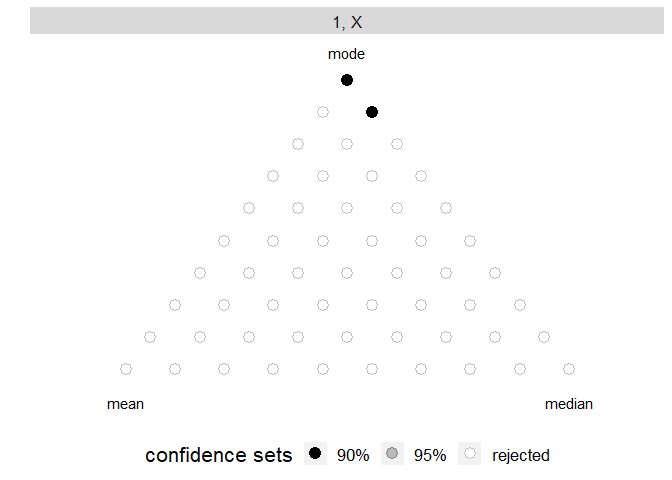
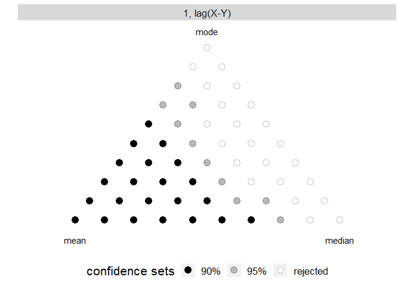

<!-- README.md is generated from README.Rmd. Please edit that file -->

# fcrat

<!-- badges: start -->

<!-- badges: end -->

The goal of fcrat is to provide easy access to the methods of the paper
“Testing Forecast Rationality for Measures of Central Tendency” by
Timo Dimitriadis, Andrew Patton, and Patrick Schmidt.

## Installation

You can install the preliminary version of fcrat from Github with:

``` r
#install.packages("devtools")
#devtools::install_github("Schmidtpk/fcrat")
```

## Example

This is a basic example which shows you how to replicate some of the
main findings of the paper. Let’s try consider one-quarter ahead
forecast of real GDP growth as released in the Greenbook by the Federal
Reserve Board. For more information see `?GDP`. We test if the
predictions are a rational mean, median or mode forecast:

The `test_central` function, applies rationality tests for the three
functionals of central tendency: Mean, median, and mode. We have to
specifiy the forecast x and the actual observations y.

``` r
library(fcrat)
#> 
#> Attaching package: 'fcrat'
#> The following object is masked from 'package:stats':
#> 
#>     lag

test_central(x = GDP$FC.first,
             y = GDP$Obs.recent)
#>   instruments  mean median  mode
#> 1         1|X 0.271  0.091 0.073
```

The output depicts the p-values for each functional. The GDP forecast is
consistent with a rational mean forecast, but partially inconsistent
with a median or mode forecast (deduced from the p-values below 0.1).

One can specify the instrument choice as a list of characters describing
each component. Above, we use the constant and the forecast as
instruments, as in the main specification of the paper. It is also
possible to check several instruments in one command:

``` r
library(fcrat)

test_central(x = GDP$FC.first,
             y = GDP$Obs.recent,
             instruments = list(c("1","X"),
                                c("1","X","lag(X-Y)")))
#>    instruments  mean median  mode
#> 1          1|X 0.271  0.091 0.073
#> 2 1|X|lag(X-Y) 0.281  0.104  0.03
```

# Test all convex combinations of mean, median, and mode

The `test_convex` function tests any convex combination of mean, median,
and mode. The plot function can be used to illustrate the confidence
sets.

## Income expectations from the Survey of Consumer Expectations

In this example, we consider the survey of consumer expectations. For
more information see `?sce`. The income expectations reported in the
labour market survey are rational mode forecasts, but inconsistent with
mean or median forecasts.

``` r
library(fcrat)

res <- test_convex(x = sce$expectation,
                   y = sce$income)
plot(res)
```



## Are exchange rates rational?

In this example, we consider exchange rates as forecasts for the next
trading day. For more information see `?exchange`. Here, we show the
results for the exchange rate between the Euro and the Japanese Yen.

``` r
library(fcrat)

data <- exchange[exchange$to== "JPY",]
res <- test_convex(x = data$fc,
                   y = data$realization,
                   instruments = c("1","lag(X-Y)"))
plot(res)
```



While the mean is in the confidence set (as postulated by the rational
market hypothesis), the median and mode are rejected.
